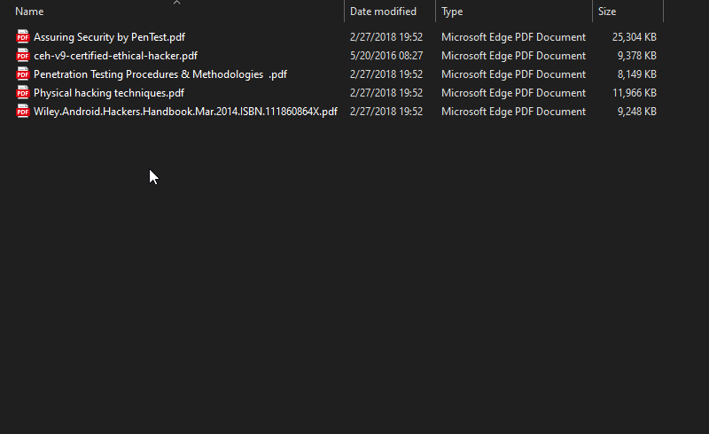

# Mark as Completed

A tool helps you in Marking...

- Movies,
- Series episodes,
- Courses videos,
- Lectures,
- Records,
- PDFs

as Completed, to facilitate their manipulating, and **save your time and effort**.

Don't memorize or move them the life is easier

> Just complete and let us mark ✔

## How to use

For first use, you need to double-click the .exe to auto config registries. When finished a success window will
appear...

Then you can use it from the **Right-click context menu** on all types of files and directories.

